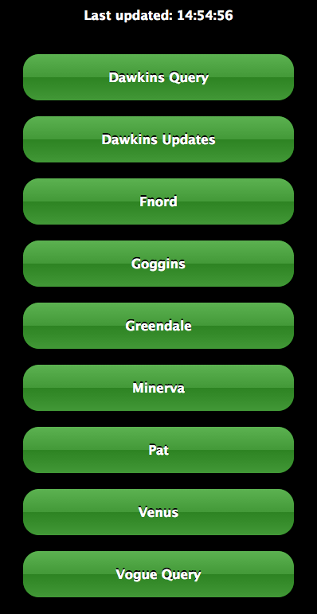

# Eir

A really easy way to monitor the health of a list of endpoints over time.

## Installation and Usage

Add to your Gemfile:

    source 'https://rubygems.org'
    gem 'eir'

At your project root, create a `uris.yaml` YAML file of the URIs you wish to monitor, e.g.:

    - http://www.google.co.uk : Google
    - http://www.yahoo.co.uk : Yahoo
    - http://www.itv.com : ITV

From the console, navigate to your project root and simply run:

    $ eir

A lightweight Sinatra app will start at `http://localhost:8700`.

Both a pidfile and logs will be generated at `server.pid`, `eir_access.log` and `eir_error.log`.

A successfully running app should have a directory structure like this:

    .
    ├── Gemfile
    ├── Gemfile.lock
    ├── eir_access.log
    ├── eir_error.log
    ├── server.pid
    └── uris.yaml

## TODO

1. Test connection error cases
2. Parse/validate URIs
3. Validate YAML
4. Some decent CSS/JS (please help!)
